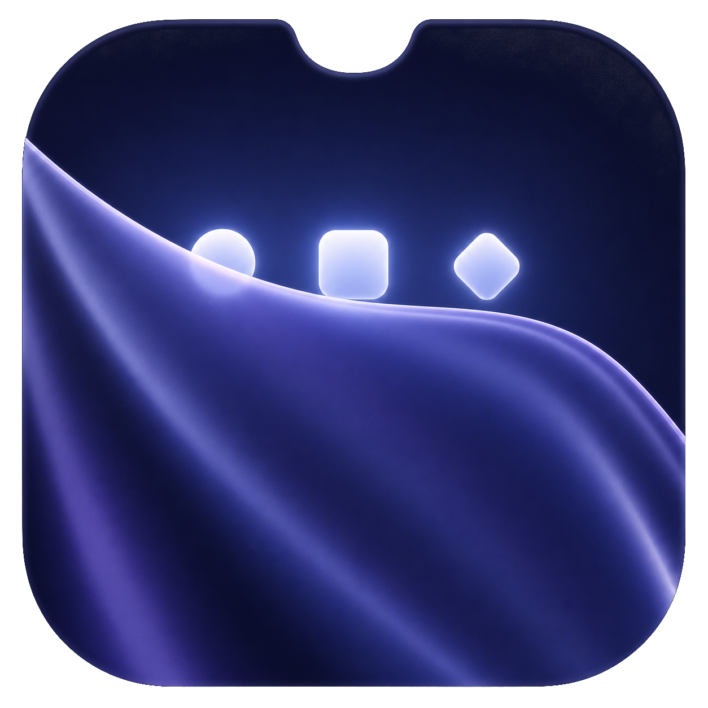
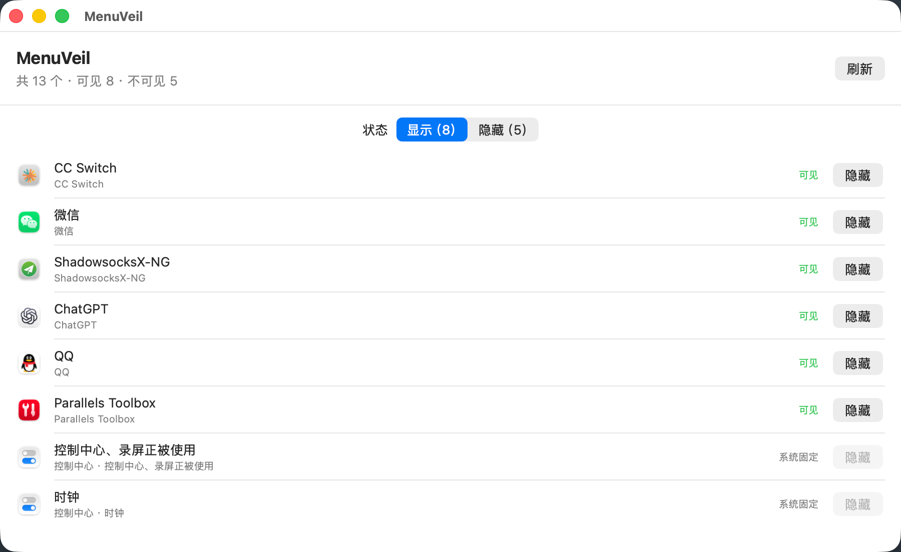
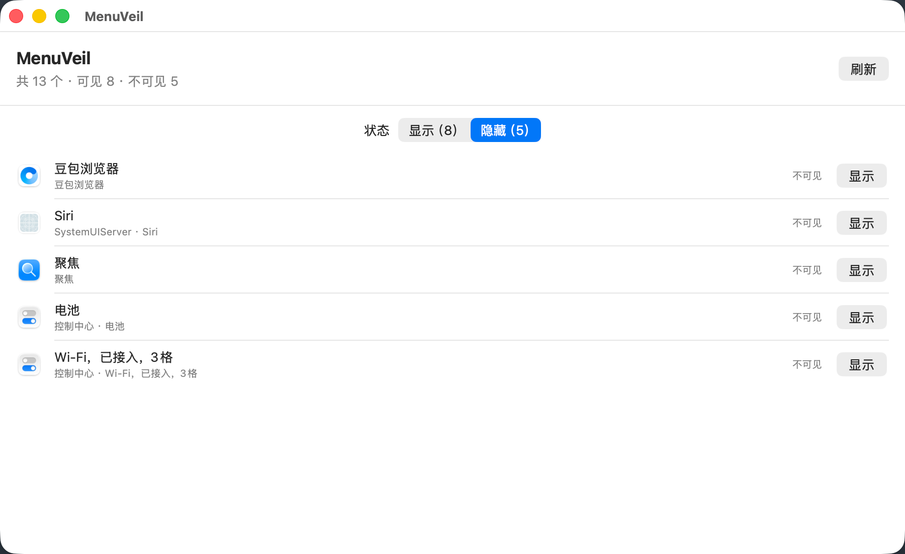
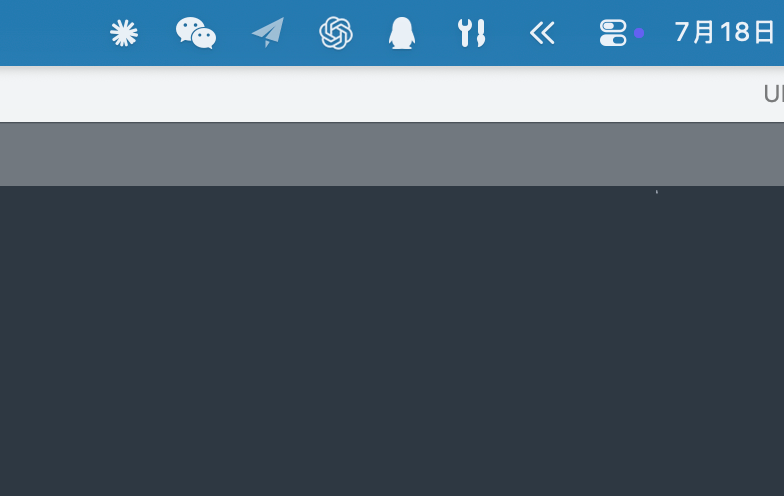
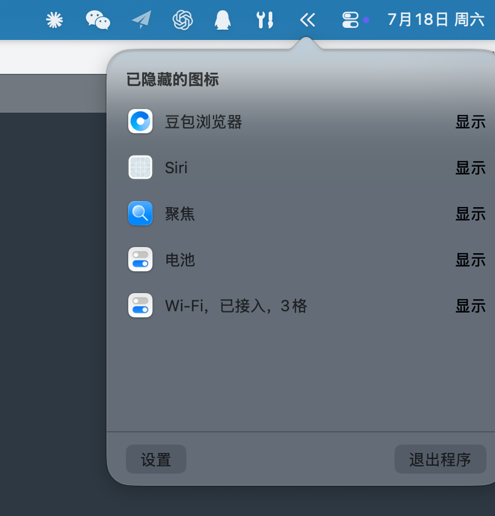

<div align="center">
  
  <h1>MenuVeil</h1>
  <p><strong>See, hide, and organize every menu bar icon—even those hidden behind the MacBook notch.</strong></p>
  <p><a href="README.md">简体中文</a> · <strong>English</strong></p>
  <p><a href="https://github.com/wangfan1314/menu-veil/releases">Download</a> · <a href="https://github.com/wangfan1314/menu-veil/issues">Report an issue</a></p>
</div>

MenuVeil is a native macOS menu bar manager. Unlike divider-based tools that require you to find and `⌘`-drag each icon first, MenuVeil discovers the menu bar items in your current session—including icons pushed off-screen by the notch or limited space—and lets you manage their visibility and order directly.

## Highlights

- **Discover everything**: List menu bar items in the current session, not only those still visible on screen.
- **Visible and hidden tabs**: Manage both sections independently without turning off the macOS Menu Bar switch.
- **Drag to reorder**: Drag the handle beside a row to update the real menu bar order.
- **Quick access**: Open hidden items from the double-chevron menu bar popover; click anywhere outside to dismiss it.
- **System item support**: Manage movable controls such as Wi-Fi, Bluetooth, Battery, Siri, and Spotlight.
- **Persistent layout**: Reuse the previous layout immediately after relaunching; newly discovered icons stay visible by default.
- **Multi-display aware**: Ignore per-display menu bar replicas created by macOS and refresh automatically when displays change.
- **Dock-free operation**: Closing Settings keeps MenuVeil in the menu bar without occupying the Dock.
- **On-device privacy**: No account, cloud service, or menu bar data upload.

## Screenshots

<table>
  <tr>
    <td width="50%" align="center"><br><strong>Visible</strong>: hide or reorder current items</td>
    <td width="50%" align="center"><br><strong>Hidden</strong>: restore or reorder hidden items</td>
  </tr>
  <tr>
    <td width="50%" align="center"><br>A compact menu bar control when everything is tucked away</td>
    <td width="50%" align="center"><br>Restore an icon without reopening Settings</td>
  </tr>
</table>

## Requirements

- macOS 14 Sonoma or later.
- The current prebuilt DMG supports Apple Silicon (M1 or later).
- Accessibility permission is required to identify and move menu bar items owned by other apps.

## Installation

1. Download `MenuVeil-<version>.dmg` from [GitHub Releases](https://github.com/wangfan1314/menu-veil/releases).
2. Open the DMG and drag MenuVeil into the Applications folder.
3. If macOS blocks the first launch, open **System Settings → Privacy & Security**, find MenuVeil, and click **Open Anyway**.
4. Follow the in-app prompt to enable MenuVeil under **System Settings → Privacy & Security → Accessibility**, then relaunch it.

Current release builds use ad-hoc signing because the project does not yet use an Apple Developer ID. Manual approval on first launch is expected macOS behavior for an unnotarized app.

## Usage

### Hide and restore

Click **Hide** in the **Visible** tab. To restore an item, use the **Hidden** tab or open the double-chevron menu bar popover and click **Show**.

### Reorder icons

Drag the three-line handle beside any movable item. MenuVeil updates the corresponding order in the real menu bar or hidden section.

### Menu bar popover

Click the MenuVeil double-chevron icon to browse hidden items. **Settings** and **Quit** are available at the bottom; clicking anywhere outside dismisses the popover.

MenuVeil saves visibility and ordering preferences. Future launches reuse the previous layout directly without replaying a multi-step rearrangement animation.

## System Items and Limitations

- Movable system controls—including Wi-Fi, Bluetooth, Battery, Siri, and Spotlight—can be hidden and reordered.
- The clock, main Control Center item, and privacy indicators for screen recording or microphone use remain fixed by macOS and are disabled in MenuVeil.
- Menu bar behavior is an implementation detail of macOS and may require compatibility updates after major system releases.
- If an icon cannot be moved, please include the macOS version, owning app, and reproduction steps in your issue.

## Build from Source

Xcode 16 or another Swift 6-compatible development environment is required.

```bash
git clone https://github.com/wangfan1314/menu-veil.git
cd menu-veil
swift test
chmod +x scripts/build-app.sh scripts/build-dmg.sh
scripts/build-app.sh
open "dist/MenuVeil.app"
```

You can also open `Package.swift` in Xcode and run the `BarEverything` scheme. `BarEverything` is the current internal build target name; the resulting app is still named MenuVeil.

## Create a DMG

Without a Developer ID, run:

```bash
scripts/build-dmg.sh
```

The default output is `dist/MenuVeil-0.1.0.dmg`. Override the version when needed:

```bash
MENUVEIL_VERSION=0.2.0 scripts/build-dmg.sh
```

Once you have a Developer ID and notarization credentials, create a signed and notarized build with:

```bash
MENUVEIL_SIGN_IDENTITY="Developer ID Application: Your Name (TEAMID)" \
MENUVEIL_NOTARY_PROFILE="MenuVeilNotary" \
scripts/build-dmg.sh
```

## Privacy

MenuVeil uses macOS Accessibility and window information APIs to identify and move menu bar items. Visibility preferences are stored locally in `UserDefaults`. The app does not upload menu bar information or make network requests.

## Contributing

Issues and pull requests are welcome. When reporting a problem, include the macOS version, MenuVeil version, the app that owns the affected icon, and clear reproduction steps.
